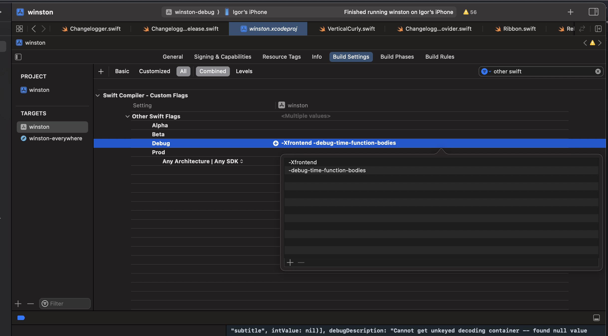

# analyze-files-build-times (afbt)

This is a script to analyze the time it takes to compile each function in a Swift file.
To use it, follow the steps below:

1. Add the flags `-Xfrontend` and `-debug-time-function-bodies` to the "Other Swift Flags" in the "Build Settings" of the project. Do it like in the image:

2. Build/run the project.

3. Go to Report Navigator (⌘+9), select the build you want to analyze, find the step in the build where it compiles the swift files (the parent step, not the child one) and click on the far right button to show the log.

4. Copy the log and paste it in a text file (.txt).

5. Make sure the script `afbt.sh` has execution permission. If it doesn't, run `chmod +x afbt.sh`.

6. Run the script `afbt.sh` with the path to the text file created in the step 4 as an argument like `./afbt.sh myLog.txt`.

7. The script will output a new file `analyzed.txt` with the time it took to compile each file.
